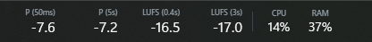

# DJ Loudness Meter

<p align="center">
  
</p>

A lightweight native Windows taskbar meter for the playback device receiving Rekordbox **PC MASTER OUT**. It uses WASAPI loopback and does not route, record, retransmit, or modify audio.



The transparent taskbar overlay shows sample peak, five-second peak hold, LUFS-M, LUFS-S, ACPI thermal-zone temperature when available, total CPU usage, and physical RAM usage. Double-click it for settings or right-click it to open settings or exit.

## Runtime design

- Pure C17 and Win32; no .NET, WPF, raylib, or GUI framework
- Event-driven WASAPI shared-mode loopback capture
- Native `libebur128` short-term and momentary loudness measurement
- One UI thread and one MMCSS audio thread
- UI repaints only at the selected 10–2000 ms interval
- CPU/RAM/temperature telemetry sampled no faster than every 500 ms
- Unavailable temperature telemetry disables itself after the first failed PDH read
- Float audio is metered without conversion; PCM uses one reusable buffer
- No FFT, waveform, recording, raw audio history, or growing work queue

The settings window provides playback-device and monitor selection, left/right placement, display-zero reference, update-rate slider, loudness/system checkboxes, device refresh, and meter reset. Settings remain compatible with the previous JSON file under `%APPDATA%\DjLoudnessMeter`.

## Requirements

- Windows 10 2004 or newer, or Windows 11, x64
- Visual Studio 2022 with Desktop development with C++
- CMake 3.24+
- vcpkg for `libebur128`

## Build

Set `VCPKG_ROOT` to a bootstrapped vcpkg checkout, then run:

```powershell
./scripts/Build-Native.ps1
```

The executable and `ebur128.dll` are written to `build\Release`.

For a release directory:

```powershell
./scripts/Publish.ps1
```

## Rekordbox setup

1. Keep the controller as Rekordbox's main audio device.
2. Enable **PC MASTER OUT** and select a Windows playback endpoint.
3. Select the same endpoint in DJ Loudness Meter.
4. Play audio.

WASAPI loopback observes everything rendered to that endpoint, not Rekordbox alone.

## Meter behavior

- The first peak is the maximum captured during the configured display interval.
- Peak hold lasts five seconds and then decays at 18 dB/s.
- Peak values turn amber at -6 dBFS and red at -1 dBFS.
- LUFS values turn amber at -12 LUFS and red at -9 LUFS.
- Five seconds of digital silence clears peak, hold, clip, and loudness state.
- **Display zero** accepts -30 to 0 dBFS. At `-9`, a raw -9 dB reading displays as 0 dB.
- Adjusted values below -99 dB display as negative infinity.

## Validation

Native tests cover stereo peak separation, clipping, PCM 16/24/32 conversion, display-zero adjustment, clamping, and the display floor. Before release, run the meter with music for at least 30 minutes and inspect working set, handles, CPU time, and capture continuity on the target audio driver.

## License

MIT. See [LICENSE](LICENSE) and [THIRD-PARTY-NOTICES.md](THIRD-PARTY-NOTICES.md).
